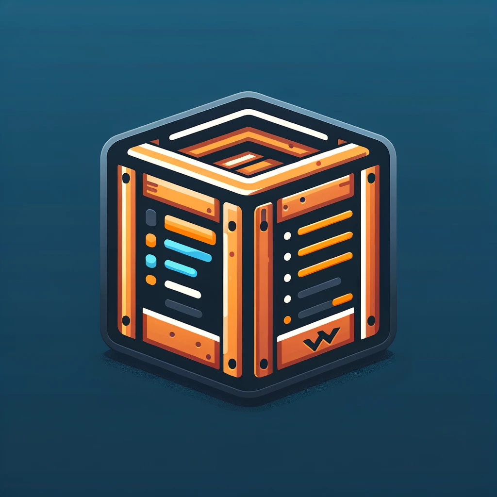

# Cargo Bin - Crates CLI / Command Runner

A Quick ,and simple way to launch cargo crates cli / commands on Vscode

## Usage

1. Press <kbd>CMD</kbd> +<kbd>SHIFT</kbd>+ <kbd>P</kbd> , select `Cargo Runner` , press <kbd>ENTER</kbd>
1. Pick among the listed Cargo Commands e.g. `cargo-nextest`,press <kbd>ENTER</kbd>
1. You will be shown `Commands` and `options` (prefix with --) , you can choose a command and press <kbd>ENTER</kbd> or immediately press <kbd>ENTER</kbd> to avoid choosing anything and do the manual overrides at the last step.
1. Last Step, Add any arguments you want e.g. `--package example --bin example -- test::test_fn`

## Demo

https://github.com/codeitlikemiley/cargo-bin/assets/28816690/8451e82a-9ada-44c7-8647-60f33f4890bf